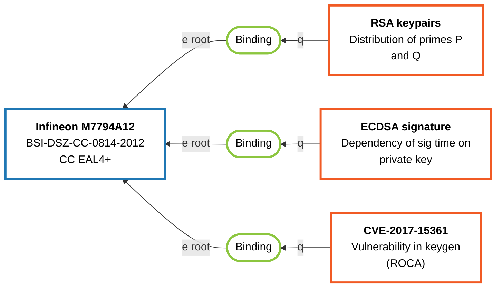

# SCRUTINY Fabric

A decentralized, permissionless protocol built on Nostr for binding security-relevant metadata to products. SCRUTINY Fabric enables transparent, auditable, and verifiable security information sharing through cryptographic signatures and hash verification. It supports comprehensive product lifecycle tracking, from certification and test results to vulnerability disclosures and performance benchmarks.



The protocol uses standard Nostr `kind:1` text notes with structured tags (`t` tags) and NIP-32 labels for semantic metadata. Events are immutable anchors that can be updated or retracted by their original author, allowing for a decentralized, append-only knowledge graph for security-critical products like smart cards, HSMs, cryptographic libraries, and hardware security modules.

> [!warning]
> **Work in Progress - Experimental Prototype**
>
> SCRUTINY Fabric is in early development and should not be used for production security decisions. The protocol specification and implementation are incomplete:
>
> - **Protocol**: Core specification defined (v0.3.2) with all event types documented in `docs/protocol-spec.md`.
> - **Lens Demo**: ~~Functional~~ Outdated React app for viewing events; supports legacy formats
> - **Event Publisher**: Outdated basic Svelte app for product events only; metadata and binding creation not yet implemented
> - **Python Tooling**: Outdated CLI tools for publishing events; basic tests included
>
> Features like full metadata publishing, binding creation, update/contestation UI, and relay optimizations are planned but not implemented. Expect breaking changes and use at your own risk. Contributions welcome!

## Quick Start

```bash
# Install dependencies (requires pnpm)
pnpm install

# Development
pnpm dev:pub      # Start event publisher (Svelte)
pnpm dev:lens     # Start lens demo (React)

# Build for production
pnpm build
```

## Project Structure

```bash
scrutiny-nostr/
├── apps/
│   ├── event-publisher/     # Svelte publisher app
│   └── lens-demo/           # React demo client
├── docs/                    # Protocol specification
├── packages/
│   └── scrutiny-fabric/     # Core protocol TypeScript library (types, parsers, validators)
├── misc/                    # Python tooling and depracated cli
├── package.json             # Workspace configuration
└── pnpm-workspace.yaml
```

## Packages

### Core Protocol Library (`packages/scrutiny-fabric`)
A highly robust, strictly-typed implementation of the SCRUTINY Fabric protocol (v0.3.2) in TypeScript. It provides:
- **Type-safe Builders**: Zero-mistake event construction templates guaranteeing accurate NIP-32 label tagging.
- **Strict Validation**: Parsing and validation with built-in defenses against adversarial inputs (e.g. tag-limit DoS protections).
- **Web-of-Trust (WoT) & Graph resolution**: Configurable N-hop bound Breadth-First Search (BFS) for endorsement aggregation and directed edge routing.
- **Secure Artifact Verification**: Memory-safe streaming architecture for safely hashing and validating NIP-92 `imeta` artifacts without risking Zip-bombs or memory exhaustion.

**Configuration:** The library uses a centralized factory pattern (`ScrutinyEngine`) allowing downstream apps to dial in their trust and strictness models:

```typescript
import { createScrutinyEngine, pubkey } from '@scrutiny-fabric/scrutiny-fabric';

const engine = createScrutinyEngine({
  trust: { 
    maxTrustHops: 3, // Enable 3-hop WoT graph resolution
    trustedPubkeys: new Set([pubkey('...')]) 
  },
  validation: {
    strictIdentifiers: false // Allow uppercase IDs like CPE:2.3:o:...
  }
});
```

*This core package has been heavily audited and possesses a 100% test coverage threshold for its core evaluation logic, including native NIP-01 in-memory `matchFilter` evaluations.*

### Event Publisher (`pnpm dev:pub`)
A SvelteKit web application for creating and publishing SCRUTINY Fabric events to Nostr relays. Users can define products (e.g., smart cards, HSMs), ~~metadata (test results, certifications, vulnerabilities), and create bindings that link them together~~ (planned for future releases).

Supports NIP-07 wallet integration for signing events and includes form validation for protocol compliance.

### Lens Demo (`pnpm dev:lens`)
A React-based demo web application for exploring and visualizing SCRUTINY Fabric events from Nostr relays. Features an interactive graph view showing relationships between products, metadata, and bindings. Includes detailed event viewers, author filtering, and support for legacy event formats. Demonstrates real-time querying and rendering of the decentralized security knowledge graph.

## Protocol

SCRUTINY Fabric defines five core event types for comprehensive security metadata management:

- **Product Events**: Identify a specific product, hardware model, or software package.
- **Metadata Events**: Describe security-relevant observations, test results, or vulnerabilities (often including NIP-92 `imeta` attachments).
- **Binding Events**: Connect precisely one Product to one Metadata event (or Product to Product) with a directional, semantic relationship (e.g., "tests", "vulnerability").
- **Update Events**: Append-only modifications of labels or content by the original author.
- **Retraction Events**: Append-only withdrawals of a previous statement by the original author.

All events use Nostr `kind:1` notes with structured `t` tags (`scrutiny_product`, `scrutiny_binding`, etc.) for categorization and NIP-32 labels (`L`, `l`) for rich key-value metadata. External identifiers use the canonical `i` tag (e.g., `cve:CVE-2017-15361`).

See [docs/protocol-spec.md](docs/protocol-spec.md) for the complete protocol specification.

## Requirements

- Node.js 20+
- pnpm 9.0.0+

## Known Issues & TODOs

- [ ] Lens demo is still pretty chatty in the console (debug `console.log` in event categorization/relationship mapping)
- [ ] Legacy event detection is best-effort (multiple historical tag variants exist in the wild); consider adding fixtures + tests
- [ ] Relay queries can get large (many `#t` variants + follow-up fetches); consider tuning filters/backoff for strict relays
- [ ] Implement full metadata event publishing in Event Publisher app
- [ ] Implement binding event creation in Event Publisher app
- [ ] Add interactions for update, contestation, and confirmation events in Event Publisher app
- [ ] Optimize relay queries and add caching for better performance
- [ ] Add CI to run:
	- `pnpm -r build` (apps)
	- `pnpm -r test` (where available)
	- `pytest` for `misc/tests`
- [ ] Add unit tests for `getLegacyScrutinyReason()` / legacy badge rendering
- [ ] Consider centralizing SCRUTINY tag variant lists (query + detection) to avoid drift
- [ ] Add linting for the Svelte app (and align repo-wide formatting/lint rules)
- [ ] Add NIP-03 - OpenTimestamps Attestations for Events

## License

MIT
