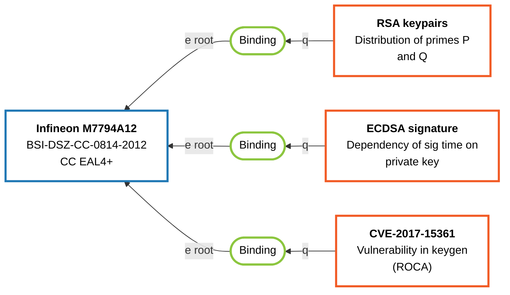
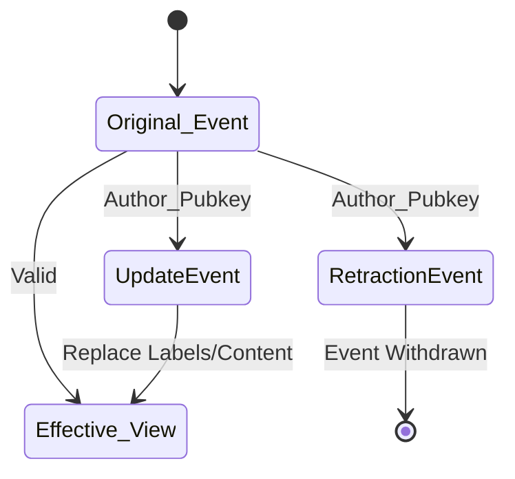

# SCRUTINY Fabric — Protocol Specification v0.3.2

**Version:** 0.3.2  
**Status:** Draft  

---

## Abstract

SCRUTINY Fabric is a decentralized protocol for linking **products** to **security-relevant metadata** (such as vulnerabilities, certifications, audits, and test results) using standard Nostr text notes (`kind: 1`).

### Motivation

The primary goal of SCRUTINY is to solve the **Discoverability problem** of security metadata. It provides a permissionless, censorship-resistant layer where end-users can obtain richer security context for products they use, while vendors can transparently increase the trustworthiness of their offerings. By utilizing a decentralized graph-based linking model, no single party acts as the sole source of truth, and users can rely exclusively on their curated list of trusted metadata providers.

---

## 1. The Conceptual Model

At its core, SCRUTINY Fabric is a directed graph built on three primary event types:

1.  **Product Events:** Define a specific vendor, product, and version.
2.  **Metadata Events:** Provide security observations (e.g., a CVE, a test report, a certification).
3.  **Binding Events:** Connect a piece of Metadata to a Product (or a Product to a Product) with a specific relationship (e.g., "tests", "contains").



Clients traverse this graph starting from a `ProductEvent` to discover all affiliated findings, yielding an "Effective View" of the product's security posture.

---

## 2. Protocol Identification & Versioning

### 2.1 Required Tags

An event is recognized as a SCRUTINY Fabric event only if **all** of the following hold true:
- `kind` MUST be `1`.
- It MUST include at least one `["t", "scrutiny_fabric"]` tag.
- It MUST include exactly one of the following SCRUTINY type tags:
  - `["t", "scrutiny_product"]`
  - `["t", "scrutiny_metadata"]`
  - `["t", "scrutiny_binding"]`
  - `["t", "scrutiny_update"]`
  - `["t", "scrutiny_retract"]`

### 2.2 Versioning

Events following this standard SHOULD include exactly one version tag: `["t", "scrutiny_v032"]`. 
- Multiple version tags render the event invalid.
- Omission of a version tag falls back to the client's local compatibility policy.
- Unknown version tags SHOULD be ignored unless specific support logic exists.

---

## 3. Data Encoding Primitives

SCRUTINY utilizes existing Nostr Improvement Proposals (NIPs) to encode structured fields, canonical IDs, and artifacts.

### 3.1 Structured Labels (NIP-32)

Labels organize product and metadata properties into key-value pairs.

```json
["L", "scrutiny:<category>:<field>"],
["l", "<value>", "scrutiny:<category>:<field>"]
```
*   **Rules:**
    *   Multiple values are formed by repeating the `l` tag for the same namespace.
    *   An empty value (`""`) is reserved exclusively for namespace deletion in `UpdateEvents`.

### 3.2 Canonical Identifiers (`i`)

Used to natively map SCRUTINY events to existing industry ecosystems (e.g., CPE, PURL).

```json
["i", "<prefix>:<value>"]
```
*   **Prefixes:** Must be lowercase ASCII. Known prefixes include `cpe`, `purl`, `atr`, `cve`, `cwe`, `cc`.

### 3.3 Artifact Attachments (NIP-92 `imeta`)

Used to embed external files (PDF reports, scripts) directly into Metadata events.

```json
[
  "imeta",
  "url https://example.org/report.pdf",
  "m application/pdf",
  "x 146c288512b1bd16b0c4fb29de255ad72c3757fcaf431cd8ef856e28f0a4aacf",
  "size 524288"
]
```
*   **Rules:** `x` (SHA-256 hash) MUST be exactly 64 hex characters.

---

## 4. Core Event Types

### 4.1 ProductEvent (`scrutiny_product`)
Defines the identity of a specific product, hardware model, or software package.

| Field / Tag | Cardinality | Requirement | Description |
| :--- | :--- | :--- | :--- |
| `content` | 1 | **MUST** | Human-readable description. |
| `i` | 0..N | SHOULD | Canonical identifiers (e.g., `purl`, `cpe`). |
| `L`/`l` | 0..N | SHOULD | Labels: `scrutiny:product:vendor`, `name`, `version`, `category`. |

### 4.2 MetadataEvent (`scrutiny_metadata`)
Represents security intelligence, tests, or empirical measurements.

| Field / Tag | Cardinality | Requirement | Description |
| :--- | :--- | :--- | :--- |
| `content` | 1 | **MUST** | Human-readable summary or full report text. |
| `L`/`l` | 0..N | SHOULD | Labels defining measurement type, tool used, or context. |
| `i` | 0..N | SHOULD | External identifiers (e.g., `cve`, `cwe`). |
| `imeta` | 0..N | SHOULD | Attached external artifacts or files. |

### 4.3 BindingEvent (`scrutiny_binding`)
Forms the edges of the SCRUTINY graph, connecting exactly two Nostr events.

**Endpoint Model:**
Directionality is strict: **`q` (Other) → `e root` (Anchor)**. The relationship describes what `q` does to `e`.

```json
["e", "<anchor_event_id>", "<relay_hint>", "root", "<pubkey_hint>"]
["q", "<other_event_id>", "<relay_hint>", "<pubkey_hint>"]
```

**Relationship Labels:**
Defined via NIP-32 labels. If missing, defaults to `related`.
*   **Directed Values:** `test`, `vulnerability`, `patch`, `certification`, `audit`, `analysis`, `contains`, `depends_on`.
*   **Symmetric Values:** `same`, `related` (Clients should not display directionality).

**Deduplication & Endorsement:**
Clients MUST deduplicate identical `(q, e root, L relationship)` edges authored by the exact same pubkey. If multiple trusted actors publish identical bindings describing the *same* relationship between the *same* product and metadata, clients SHOULD sum these into a single logical edge with an aggregated endorsement score (e.g., WoT weight).

> **Immutability:** BindingEvents are strictly immutable. They CANNOT be targeted by `UpdateEvents`. Mistakes must be handled via a `RetractionEvent`.

---

## 5. State Modification (Updates & Retractions)

### 5.1 UpdateEvent (`scrutiny_update`)
Append-only modifications.

*   **Authoritative Rule:** Valid ONLY if `UpdateEvent.pubkey == TargetEvent.pubkey`.
*   **Target:** `e root` MUST point to a `ProductEvent` or `MetadataEvent`.
*   **Semantics:** 
    *   Replaces content via `scrutiny:update:content`.
    *   Replaces labels per namespace (empty `l` deletes the namespace).
    *   `i` and `imeta` replacements are full-set operations if present in the update.

### 5.2 RetractionEvent (`scrutiny_retract`)
Append-only withdrawals of previous statements.

*   **Authoritative Rule:** Valid ONLY if `RetractionEvent.pubkey == TargetEvent.pubkey`.
*   **Target:** Can target Product, Metadata, Binding, and Update events. Retractions themselves cannot be retracted.

---

## 6. Client Behavior: Effective View

Clients compute the current valid state of an event ("Effective View") by merging authoritative updates chronologically, discarding retracted state.



**Algorithm:**
1. Collect target event.
2. Fetch authoritative updates; drop those that have been retracted.
3. Apply remaining updates ordered by `created_at` (ascending), then `id` (lexicographically).
4. If a `MetadataEvent` or `ProductEvent` has an authoritative retraction, or if a user-trusted `RetractionEvent` targets a `BindingEvent`:
   * The retracted entity SHOULD be hidden in default views.
   * The restricted/retracted entity SHOULD remain accessible for audit purposes with a clear indication of its retracted status.

---

## 7. Trust & Network Traversal

Validation of the graph fundamentally relies on user-curated Web of Trust.

1. **Baseline Trust:** Users maintain a whitelist of trusted pubkeys.
2. **Admission Rule:** An event is admitted to the client's view if:
   * It is authored by a trusted pubkey OR
   * It is connected via a **trusted BindingEvent** as an anchor (`e root`) or other (`q`) endpoint.

**Product-First Traversal:**
To view a product's security posture, clients query relays for bindings anchored to the product ID, filter for trusted authors, and resolve the attached `q` metadata nodes.

**Metadata-First Traversal:**
To find all products affected by or associated with a specific piece of metadata (e.g., "Which products are vulnerable to this CVE?"), clients query relays for bindings quoting the metadata ID:

```json
{ "kinds": [1], "#t": ["scrutiny_binding"], "#q": ["<metadata_event_id>"] }
```

---

## 8. Optional Features

These NIPs are fully compatible with SCRUTINY Fabric and enhance the ecosystem without altering sequence semantics.

*   **Proof-of-Work (NIP-13):** Use a `nonce` tag. Clients MAY require minimum PoW for spam mitigation or ranking.
*   **Accessibility (NIP-31):** Include an `alt` tag providing plain-text summaries for screen readers.
*   **Lightning Zaps (NIP-57):** Standard zaps to boost/reward/uprank high-quality metadata/product entries.
*   **Reactions (NIP-25):** Standard `kind: 7` reactions.
*   **Reports (NIP-56):** Report spam (`kind: 1984`). Clients MAY downrank reported hashes.
*   **OpenTimestamps (NIP-03):** Attestation events (`kind: 1040`) for cryptographic timestamping of discoveries.

---

## 9. Examples

### 9.1 Product and Metadata Bound Together 

*A simplified view of binding a ROCA vulnerability analysis to the Infineon M7794A12 smartcard.*

**Product Event (`...1111`)**
```json
{
  "kind": 1,
  "content": "Infineon M7794A12 (BSI-DSZ-CC-0814-2012, CC EAL4+)",
  "tags": [
    ["t", "scrutiny_fabric"],
    ["t", "scrutiny_product"],
    ["t", "scrutiny_v032"],
    ["i", "cpe:2.3:h:infineon:m7794a12:-:*:*:*:*:*:*:*"]
  ],
  "pubkey": "vendor_pubkey..."
}
```

**Metadata Event (`...2222`)**
```json
{
  "kind": 1,
  "content": "CVE-2017-15361 Vulnerability in keygen (ROCA)",
  "tags": [
    ["t", "scrutiny_fabric"],
    ["t", "scrutiny_metadata"],
    ["t", "scrutiny_v032"],
    ["L", "scrutiny:metadata:measurement_category"],
    ["l", "vulnerability", "scrutiny:metadata:measurement_category"],
    ["i", "cve:CVE-2017-15361"]
  ],
  "pubkey": "researcher_pubkey..."
}
```

**Binding Event (`...3333`)**
```json
{
  "kind": 1,
  "content": "Binding ROCA vulnerability to Infineon M7794A12.",
  "tags": [
    ["t", "scrutiny_fabric"],
    ["t", "scrutiny_binding"],
    ["t", "scrutiny_v032"],
    ["e", "1111...", "", "root", "vendor_pubkey..."],
    ["q", "2222...", "", "researcher_pubkey..."],
    ["L", "scrutiny:binding:relationship"],
    ["l", "vulnerability", "scrutiny:binding:relationship"]
  ],
  "pubkey": "researcher_pubkey..."
}
```
